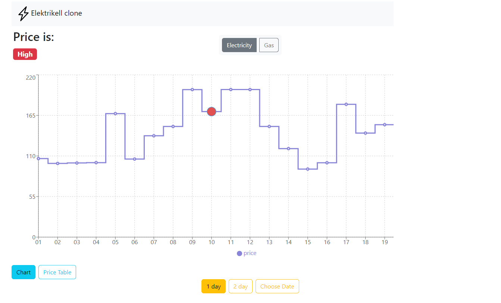

# Electrikell.ee clone created with React

This website is an analogue of the Estonian website elektrikell.ee plus added feature to show latest GAS price.

## Live Demo

https://jarominas-elektricitytime.netlify.app/



## You can try out this project

Clone the repository using Git

```sh
git clone https://github.com/Jarominas/elektricityTime
```

Run the command

```sh
npm install
```

After the dependencies have been installed, run the command

```sh
 npm run dev
```

## Build With

- React JS
- Redux Toolkit
- Bootstrap
- Rechart

##

## API From

Using the API from elering.ee to show electricity and gas prices.

https://dashboard.elering.ee/assets/api-doc.html
